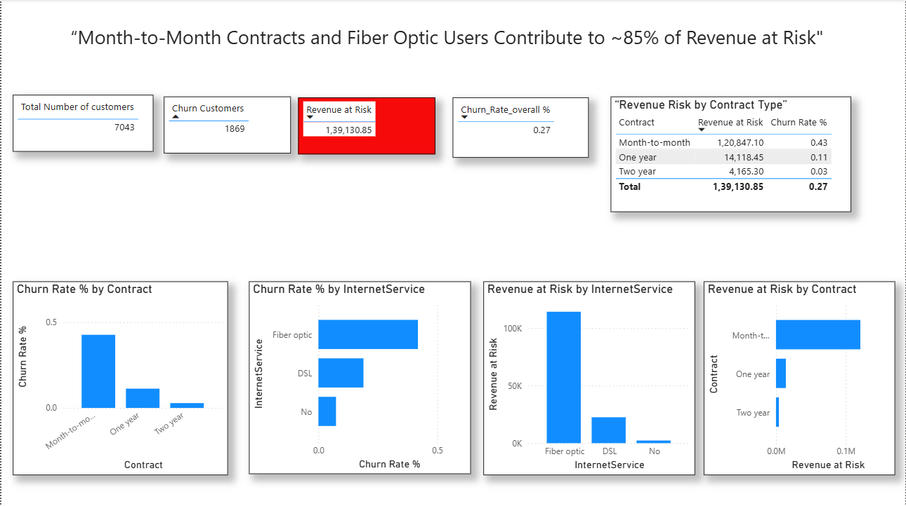

# 🚀 Customer Churn & Revenue Risk Analysis (Telecom)

## 📊 Dashboard Preview

---

## 📊 Business Problem

Customer churn directly impacts revenue, profitability, and customer lifetime value in telecom businesses.

This project focuses on:
- Identifying high-risk customer segments  
- Quantifying revenue loss due to churn  
- Delivering actionable, data-driven business recommendations  

---

## 🎯 Key Outcomes

- Built churn prediction model (~73% accuracy)  
- Identified **month-to-month customers as highest churn risk (~43%)**  
- Found **fiber optic users as high churn contributors**  
- Estimated **~26% overall churn rate**  
- Quantified **~139K+ revenue at risk**  
- Highlighted segments driving **~85% of revenue loss**  

---

## 📁 Dataset

- Source: Telco Customer Churn Dataset (~7000 records)  
- Features:  
  - Demographics (Gender, Senior Citizen, Dependents)  
  - Account Info (Tenure, Contract Type)  
  - Services (Internet, Streaming, Tech Support)  
  - Billing (Monthly & Total Charges)  
- Target Variable: `Churn`  

---

## ⚙️ Approach

### 1. Data Preparation
- Removed `customerID`  
- Applied one-hot encoding  
- Validated data quality  

### 2. Feature Engineering
- Created `Churn_Yes` binary variable  
- Prepared dataset for modeling  

### 3. Model Development
- Logistic Regression  
- Train/Test Split: 80/20  
- Handled imbalance using:
- 
### 4. Model Evaluation
- Accuracy: ~73%  
- Evaluated using:  
  - Confusion Matrix  
  - Precision, Recall, F1-score  
- Improved recall for churn detection  

---

## 📈 Key Insights

- Month-to-month contracts have highest churn  
- Fiber optic users churn more than others  
- Electronic check users show higher churn  
- Low-tenure customers are highest risk  

---

## 💰 Revenue Impact Analysis

- Overall churn rate: ~26%  
- High-risk segments drive most revenue loss:  
  - Month-to-month contracts  
  - Fiber optic users  

👉 Shifted focus from prediction → business impact  

---

## 📊 Power BI Dashboard

### Key Features:
- Total Customers KPI  
- Churn Customers KPI  
- Churn Rate KPI  
- Revenue at Risk KPI  
- Churn by Contract Type  
- Churn by Internet Service  
- Revenue at Risk by Segment  

### Key Insight:
Month-to-month contracts and fiber optic users contribute to ~85% of revenue at risk.

---

## 🧠 Key Drivers of Churn

- Contract type  
- Internet service (Fiber optic)  
- Payment method  
- Monthly charges  
- Customer tenure  

---

## 📊 Business Recommendations

- Promote long-term contracts  
- Target fiber optic users  
- Improve electronic payment experience  
- Focus on low-tenure customers  
- Offer loyalty incentives  

---

## 🛠️ Tech Stack

- Python (Pandas, NumPy)  
- Scikit-learn  
- Power BI  

---

## 📌 Business Impact

- Identified high-risk segments  
- Quantified revenue loss  
- Enabled data-driven retention strategies  

👉 Small churn reduction = major revenue gain  

---

## 🚀 Future Improvements

- Advanced ML models (XGBoost, Random Forest)  
- Streamlit deployment  
- Real-time pipeline automation  

---

## 👤 Author

Ramashehu  
Data Analyst | Business Intelligence | Machine Learning
